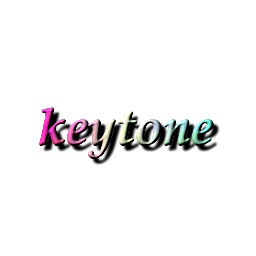

<p align="center" style="text-align: center">
  <br/>
</p>
<p align="center">
  Let the keys awaken a comfortable sound.
  <br/>
  <br/>
  <a href="https://github.com/LuSrackhall/KeyTone/blob/main/LICENSE">
    
  </a>
  <a href="https://github.com/LuSrackhall/KeyTone/tags" rel="nofollow">
    
  </a>
</p>

<div align="center">
<strong>
<samp>

<!-- [English](README.md) · [简体中文](README.zh-CN.md) -->
[English](README.md) · [简体中文](README.zh-CN.md)

</samp>
</strong>
</div>

# KeyTone

## Introduction

KeyTone is a practical software that can simulate the sound of keystrokes in real-time in environments where silence is required, thereby enhancing your comfort when using a computer.

Although there are already many similar software on the market, KeyTone is still committed to providing users with the best experience.

In addition, KeyTone is an open-source software that follows the GPL license.

## Features

* Simple functionality, ready to use out of the box.
* Key press and release can be independently bound to sound effects.
* Designed based on real key trigger conditions, sound effects are only played at the moment of pressing and releasing, and will not be repeated while holding down.
* Highly customizable, users can quickly customize the sound of keys according to their own needs. This software has designed and developed a rich and convenient series of functions around key sound albums.
* Provides rich [documentation support](https://keytone.xuanhall.com/zh/guide/getting-started/quick-start/) to help users quickly understand the software's features as much as possible.

## Highlights

Unleash your creativity with keystroke sounds to craft a unique and personalized auditory experience.

KeyTone does not provide any audio files—this is by design!
> We encourage you to tap into your creativity by uploading your own or collected audio to create your personalized keystroke sound collection.

With KeyTone, you can:
* Combine multiple sounds into a single ***advanced sound*** and bind it to a single key, setting these sounds to play randomly or in sequence each time the key is pressed (playing one sound at a time).
* Allow these ***advanced sounds*** to be combined, inherited, and nested with each other, helping you create rich, varied sound effects and unlocking endless possibilities for keystroke sounds.

* Of course, as a prerequisite, the sound files (or audio files) are not provided in this project and will not be provided in the future.

KeyTone offers you a stage for free creation, turning every keystroke into a unique piece of sound art.

## Installation

You can obtain **KeyTone** through the following methods:

1. **GitHub Releases**

   As an open-source project, you can download the latest version for free from our [GitHub Releases](https://github.com/LuSrackhall/KeyTone/releases) page.

2. **Official Website**

   You can also visit our [official website](https://keytone.xuanhall.com) to get the latest version and installation instructions for free.

3. **App Stores**

   Get the latest version of KeyTone through official app stores on various platforms.
   * Windows &nbsp;—— &nbsp;&nbsp;&nbsp; Get from [Microsoft Store](https://apps.microsoft.com/store/detail/9NGKDXHPGJXD?cid=DevShareMCLPCS)

      &nbsp;&nbsp;<a href="https://apps.microsoft.com/detail/9ngkdxhpgjxd?referrer=appbadge&mode=direct"></a>

   * MacOS &nbsp;&nbsp;&nbsp; —— &nbsp;&nbsp;&nbsp; No plans to list yet

   The advantage of downloading through app stores is that you can get automatic update support for the listed software. In addition, the built-in sandbox mechanism of app stores and the strict application review management mechanism can provide users with further security guarantees.
  
**KeyTone software is open-source and free,** but we also welcome everyone to purchase through app stores.
<blockquote style="border-left:none; padding-left:0;">
<p>Like most open-source products, KeyTone cannot develop on its own. Therefore, purchasing or other forms of sponsorship can provide financial support to developers, which is beneficial for the continuous maintenance and iteration of the project.</p>
</blockquote>

## System Requirements

* Windows 10 or higher. macOS 11 or higher.
* Audio output device.

## Stargazers over time

[](https://starchart.cc/LuSrackhall/KeyTone)

## Development Environment & Local Debugging

The project requires the following development environment:

* Go 1.22.0
* Node.js 18.x
* Quasar CLI

### Setup Steps on Windows

1. Install [Go 1.22.0](https://go.dev/dl/) and configure your environment variables.
2. Install [Node.js 18.x](https://nodejs.org/en/download/).
3. Install Quasar CLI globally:

   ```shell
   npm install -g @quasar/cli
   ```

4. Install frontend dependencies:

   ```shell
   cd frontend
   npm install
   ```

5. Start the development environment (Electron desktop):

   ```shell
   quasar dev -m electron
   ```

## Roadmap

The project's roadmap can be found [here](https://github.com/LuSrackhall/KeyTone/milestones). Please check it before creating enhancement requests. 😊

## Issues

Welcome any ideas!

## Contributions

Welcome contributions in any form!
<!-- Please check our contribution guidelines for details. -->

<!-- ## Star History

<a href="https://www.star-history.com/#LuSrackhall/KeyTone&Date">
 <picture>
   <source media="(prefers-color-scheme: dark)" srcset="https://api.star-history.com/svg?repos=LuSrackhall/KeyTone&type=Date&theme=dark" />
   <source media="(prefers-color-scheme: light)" srcset="https://api.star-history.com/svg?repos=LuSrackhall/KeyTone&type=Date" />
   
 </picture>
</a> -->

## License

This project follows the [GPL License](https://github.com/LuSrackhall/KeyTone/blob/main/LICENSE).

## Copyright

Copyright (C) 2024-present LuSrackhall